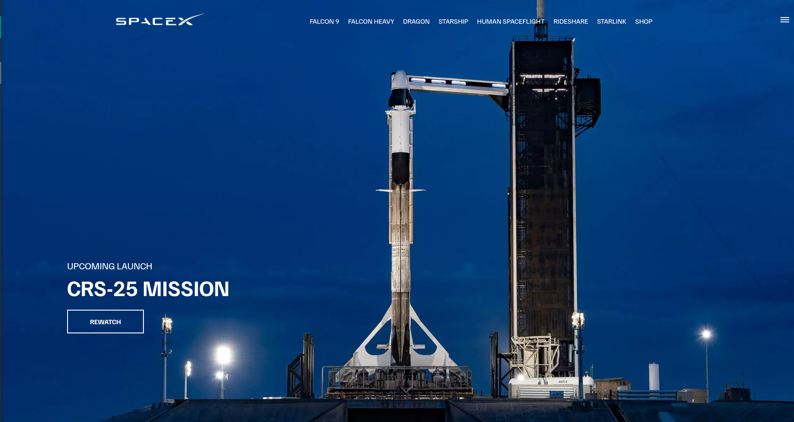
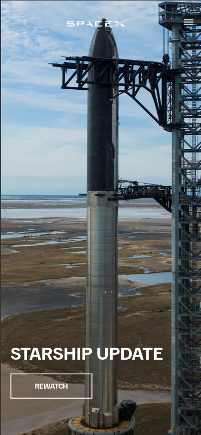

# 🚀 SpaceX Website Clone


A visually rich and responsive **SpaceX homepage clone**, built using modern **HTML, CSS, and JavaScript**. This project replicates the smooth animations, mobile menu, and scroll-based transitions found on the official [spacex.com](https://www.spacex.com) homepage.

> ✅ Hosted on **Netlify**: [vikashyadavspacexclone.netlify.app](https://vikashyadavspacexclone.netlify.app)

---
## 📸 Preview


*Homepage layout on desktop*

### 📱 Mobile View



*Mobile responsive menu with hamburger toggle*

---

## 🧰 Tech Stack

- 🖼️ HTML5
- 🎨 CSS3 (Flexbox, Animations)
- ⚙️ JavaScript (DOM Manipulation, Event Handling)
- 📱 Responsive Design
- ☁️ **[Netlify](https://www.netlify.com/)** for hosting

---

## ✨ Features

- 🔥 Hero section with animated center text and background
- 🎯 Scroll-triggered fade-out of text (like SpaceX)
- 📱 Fully responsive navigation (desktop + mobile)
- 📊 Animated counters for stats (missions, visits, etc.)
- 🎨 Clean UI and design closely resembling the real site

---

---

## 🚀 Getting Started Locally

Clone the repo and open `index.html` in your browser:

```bash
git clone https://github.com/yourusername/spacex-clone.git
cd spacex-clone
open index.html

